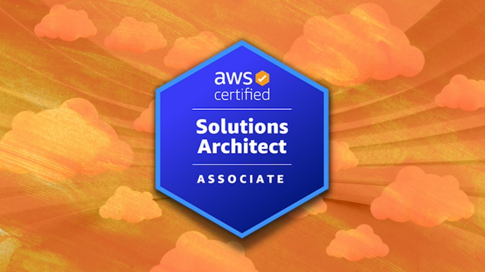

# AWS Solutions Architect - Mark's Study Notes

A collection of bullet points for each AWS Solutions Architect topic as taught by [AWS Certified Solutions Architect: Zero to Mastery](https://zerotomastery.io/courses/aws-certified-solutions-architect-bootcamp/) and using ChatGPT summaries

- [IAM](1-iam.md)
- [Compute](2-compute.md)
- [Elastic Load Balancing & Scaling](3-elastic-load-balancing-and-auto-scaling.md)
- [Networking](4-networking.md)
- [Storage](5-storage.md)
- [Databases](6-databases.md)
- [Data Migration & Transfer](7-data-migration-and-transfer.md)
- [Analytics](8-analytics.md)
- [Monitoring](9-monitoring.md)
