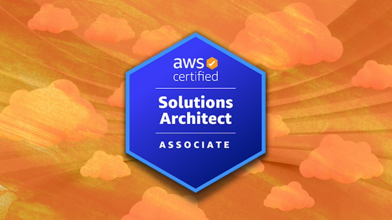

# AWS Solutions Architect - Mark's Study Notes

A collection of bullet points for each AWS Solutions Architect topic as taught by [AWS Certified Solutions Architect: Zero to Mastery](notes/https://zerotomastery.io/courses/aws-certified-solutions-architect-bootcamp/) and using ChatGPT summaries

# Topics

- [IAM](notes/1-iam.md)
- [Compute](notes/2-compute.md)
- [Elastic Load Balancing & Scaling](notes/3-elastic-load-balancing-and-auto-scaling.md)
- [Networking](notes/4-networking.md)
- [Storage](notes/5-storage.md)
- [Databases](notes/6-databases.md)
- [Data Migration & Transfer](notes/7-data-migration-and-transfer.md)
- [Analytics](notes/8-analytics.md)
- [Monitoring](notes/9-monitoring.md)
- [Security & Compliance](notes/10-security-and-compliance.md)
- [Automation & Governance](notes/11-automation-and-governance.md)
- [DNS & Network Routing](notes/12-dns-and-network-routing.md)
- [Application Integration](notes/13-application-integration.md)
- [Artificial Intelligence & Machine Learning](notes/14-artificial-intelligence-and-machine-learning.md)
- [Backup & Recovery](notes/15-backup-and-recovery.md)
- [Billing & Pricing](notes/16-billing-and-pricing.md)
- [Well-Architected Framework & Cloud Adoption Framework](notes/17-well-architected-framework-and-cloud-adoption-framework.md)
